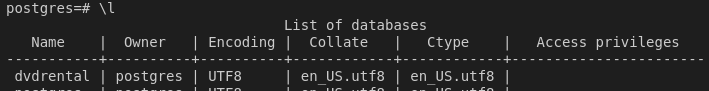
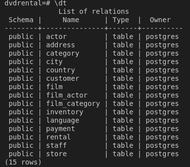
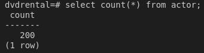

# Setup a Sample PostgreSQL Database

## Step 1: Create, Start, and Connect to the Sample Database

### Start the database (assuming docker is installed)
**Note**: you can use your own DB but you'll need to adapt the instructions for your use case.

Start the database:
```bash
docker compose up --build
```

Connect to the database:
```bash
psql -U postgres --port 54321 -h localhost
```
Enter the password:

`password`

Confirm the db is created:
```bash
\l
```
Expected output should contain a line for the dvdrental DB:



**Exit the pgsql prompt using the `exit` command**

## Step 2: Restore the test database

The database file **dvdrental.tar** is included in this project but all credit goes to **www.postgresqltutorial.com**

### Run the `pg_restore` command to build and populate the db

```bash
pg_restore -U postgres -d dvdrental -h localhost --port 54321 "dvdrental.tar"
```

### Validate the database

#### Connect with psql:
```bash
psql -U postgres --port 54321 -h localhost
```
and enter the password...

#### Switch to the dvdrental database:
```bash
\c dvdrental
```

#### Verify the tables:
```bash
\dt
```
**Example:**



#### Spot check data
```bash
select count(*) from actors;
```
**Example:**

